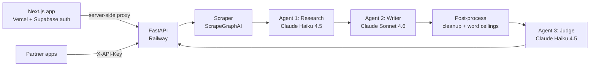

# Scrapitch

**Paste a company's URL. Get three researched, scored outreach drafts in about ten seconds.**

Live at **[scrapitch.com](https://scrapitch.com)**. I built it solo: product, frontend, backend, AI pipeline, deployment.

<!-- TODO: add a 20-second GIF of URL → drafts here. This is the first thing a reviewer looks at. -->

---

## What it does

Most cold outreach fails because nobody has time to research each recipient. Scrapitch does the research:

1. You paste a public URL: a company site, a lab page, a founder's portfolio.
2. You pick a use case: **sales, job search, graduate-school outreach, founder fundraising, or networking**. Optionally, you add your resume.
3. Three agents read the page, write three drafts in different frameworks, and score each one with its reasoning.

Nothing sends automatically. You pick a draft, edit it, and send it yourself.

## Architecture



| Stage | What it does |
|---|---|
| **Scraper** | Extracts what the company does, who it serves, recent launches, and specific details. Bare domains resolve to a page that fits the use case first (for example `/careers` for job search). Thin or blocked pages degrade gracefully instead of erroring. A paste-text fallback covers gated sites. Scrapitch never scrapes LinkedIn or X. |
| **Research agent** | Turns the raw scrape into structured signal for the chosen use case. Returns strict JSON, with a retry on malformed output. |
| **Writer agent** | Writes three variants in three frameworks: problem-agitate-solution, value-first, and curiosity icebreaker. Each has a hard word ceiling per use case and per variant. Hard rule against fabrication: a draft may only claim things that come from your input or the scraped page. |
| **Judge agent** | Scores each draft against a six-factor weighted rubric: personalization, length, single CTA, context-first framing, subject line, and spam signals. Weights differ by use case, and the reasoning is shown to the user. |

## Engineering decisions worth noting

- **Model chosen per agent.** Haiku handles extraction and scoring, and Sonnet writes. Each agent's model is an env var, so cost and quality can be tuned without a deploy.
- **Partner API.** Per-key authentication and per-partner rate limits (`slowapi`). Keys are kept server-side behind a proxy route; [INTEGRATION.md](INTEGRATION.md) shows the pattern partners follow.
- **Use-case routing.** One engine with five framings. Prompts, word limits, rubric weights, and URL resolution change with the use case.
- **Resume parsing.** Claude reads PDF or DOCX files into a typed Pydantic schema, which grounds the job-search drafts in what you've actually done.
- **CI/CD.** GitHub Actions deploys the frontend to Vercel when it changes on `main`. The backend runs on Railway, and a workflow checks it's alive after backend changes.
- **Shipped like a product.** Real privacy policy (with a GDPR section) and terms, account system, FAQ.

## History

- **v1 (Mar 2026):** a Streamlit prototype (`app.py`).
- **v2 (May 2026):** a Next.js frontend and five use cases.
- **Sep 2026:** partner API and an integration guide for external apps.

## Run locally

```bash
# backend: needs ANTHROPIC_API_KEY and SCRAPEGRAPH_API_KEY in .env
# optional: PARTNER_API_KEYS, MODEL_RESEARCH / MODEL_WRITER / MODEL_JUDGE
pip install -r requirements.txt
uvicorn main:app --reload

# frontend: needs NEXT_PUBLIC_SUPABASE_URL, NEXT_PUBLIC_SUPABASE_ANON_KEY, API_ORIGIN, SCRAPITCH_API_KEY
cd scrapitch-frontend && npm install && npm run dev
```

## Known limitations / next

- The judge's rubric is fixed and isn't yet calibrated against human ratings.
- Fabrication is prevented by instructions only; no automated check verifies each claim against the scraped page yet.

---

Built by [Kishan Kommana](https://linkedin.com/in/kishan-preetam-kommana) · AI Engineer · open to roles in the US and remote.
